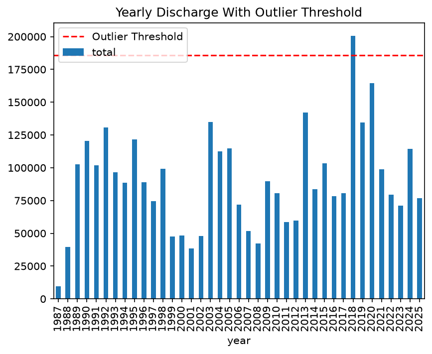
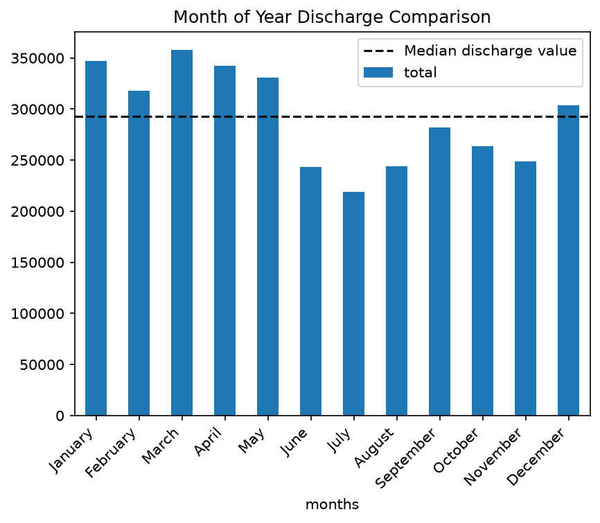
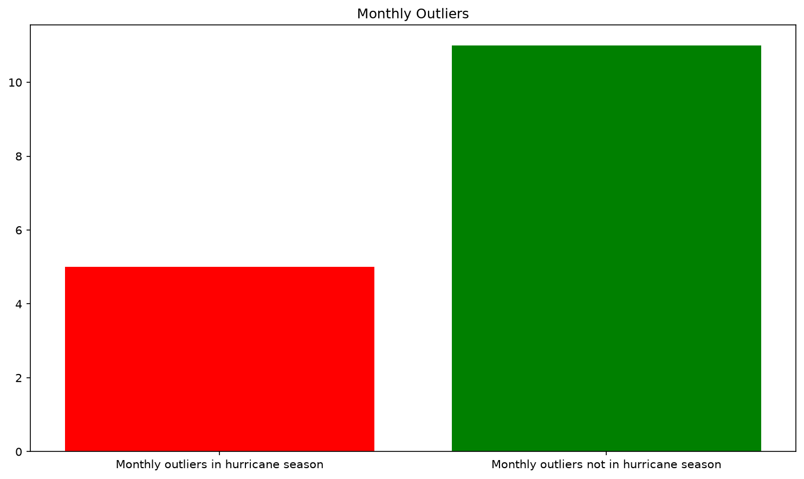
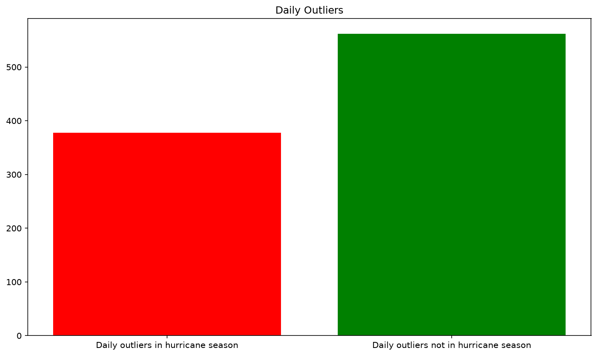
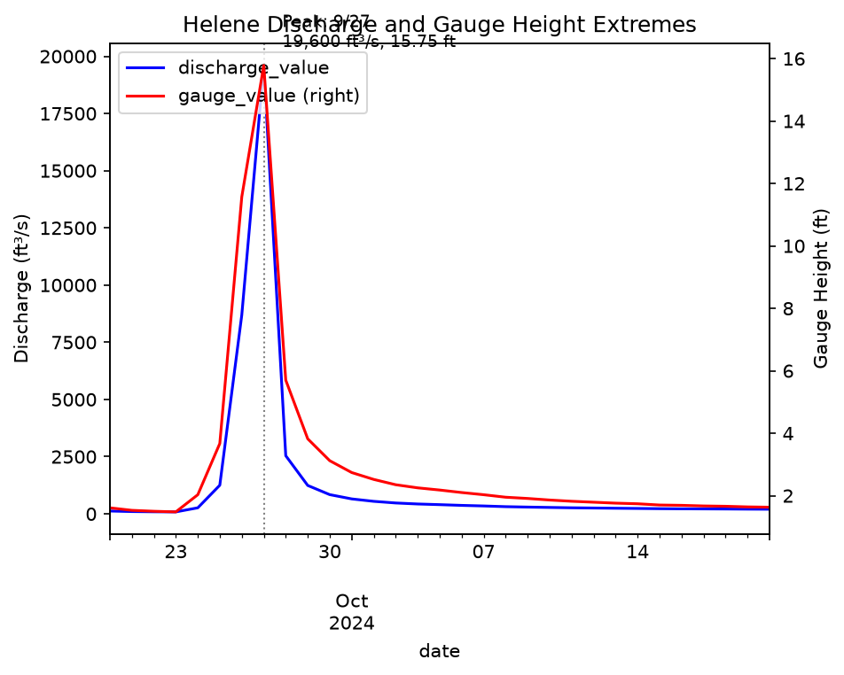

# Hydrological Analysis of the Catawba River in Western NC

A 38-year data analysis of USGS gauge 02137727 (Catawba River near Pleasant
Gardens, NC), examining how inland-moving hurricane remnants affect
discharge, gauge height, and water temperature on a mountain-headwater
river.

## Key Findings

- Non-hurricane weather drives the majority of this river's extreme
  discharge events — 12 of 16 outlier months (75%) and roughly 580 of ~960
  outlier days occurred outside Atlantic hurricane season — but hurricane
  remnants produce a disproportionate share of the *most* severe individual
  events, accounting for 7 of the top 10 highest-discharge days on record.
- The river's all-time peak discharge, 19,600 ft³/s, occurred on
  September 27, 2024, during Hurricane Helene — more than 78x the 38-year
  mean.
- Winter and spring (December–May), not hurricane season, are this river's
  true high-discharge baseline, driven by reduced evapotranspiration during
  forest dormancy and orographic lift from Gulf moisture — not snowmelt.
- 2018, not 2024, holds the highest cumulative annual discharge in the
  38-year record, despite 2024 containing the single highest daily reading
  — a distinction between peak intensity and total volume.
- Water temperature is decoupled from discharge's storm-driven behavior
  entirely, showing no meaningful outliers and tracking ordinary seasonal
  patterns regardless of storm activity.

## Overview

I came into this project with a general question: how does the Catawba
River change throughout the year? Over the course of the analysis, that
question was reshaped multiple times, landing on its final form: how much
do hurricane remnants affect the natural metrics of the Catawba River?
This required tracing the analysis through yearly, monthly, and daily
grains of discharge, gauge height, and temperature, and repeatedly testing
— and revising — my own assumptions about what was driving the extremes I
found along the way.

## Data Source

Data was pulled from the USGS OGC API for monitoring gauge 02137727,
located on the Catawba River near Pleasant Gardens, NC, in McDowell
County. The API returned three parameters — discharge, gauge height, and
temperature — each with mean, min, and max statistical IDs. Mean was
selected as the basis for this analysis, as it held the most complete date
coverage:

- **Discharge (ft³/s):** complete, no gaps, 11-11-1987 to 12-31-2025
- **Gauge height (ft):** begins 10-01-2001, 78 date gaps
- **Temperature (°C):** begins 04-25-2013, 6 date gaps

199 discharge readings carry a qualifier of "Estimated," used by USGS when
the standard stage-to-discharge conversion breaks down (ice, equipment
issues, channel reshaping). All readings, including the record 19,600
ft³/s peak, carry an "Approved" approval status.

## Tools & Methods

- **Python** (pandas) for data acquisition, cleaning, transformation, and
  analysis
- **matplotlib** for visualization
- **USGS OGC API** with cursor-based pagination for data acquisition
- **IQR-based outlier detection** (chosen over z-score due to strong
  right-skew in the underlying distributions)
- **Distribution analysis** (skewness, kurtosis) to characterize each
  parameter's behavior
- **Comparative baseline analysis** (hurricane season vs. non-hurricane
  season; hurricane-attributed vs. non-attributed events)

## Repository Structure

```
catawba_river_project/
├── 01_pull_data.py              # API extraction with pagination
├── 02_clean_explore.py          # Cleaning, outlier detection, EDA
├── 03_transform_pivot.py        # Wide-format pivot, merged dataset
├── 04_exploratory_analysis.py   # Yearly/monthly/daily investigation
├── 05_visualizations.py         # Final chart generation
├── data/                        # Cleaned parquet checkpoints (gitignored)
├── visuals/                     # Saved chart outputs (.png)
├── notes/
│   └── findings-raw-*.md        # Working investigation logs, by parameter
├── findings.md                  # Organized, final findings by parameter
└── README.md
```

## How to Reproduce

1. Clone the repository
2. Install dependencies: `pip install -r requirements.txt`
3. Run scripts in numbered order (`01` through `05`); each script loads
   from the previous step's saved checkpoint in `data/`

## Detailed Findings

### Discovering the Outlier

An initial statistical overview of discharge values showed a mean of 251
ft³/s, a standard deviation of 380, and a maximum of 19,600 ft³/s — more
than 78 times the mean. Checking this value against the data's `qualifier`
and `approval_status` columns confirmed it was not a data error: it
carried no "Estimated" qualifier, per the U.S. Geological Survey[^1], and
its approval status was "Approved." The reading was tied to September 27,
2024 — the date of Hurricane Helene's impact on western NC. This discovery
reshaped the entire direction of the analysis toward hurricane effects on
inland, mountain-headwater rivers.

### Yearly Analysis

Yearly discharge totals showed a near-normal distribution (kurtosis
0.9356). Using IQR-based fences, only one year — 2018 — registered as a
statistical outlier.



Cross-referencing hurricane tracking data[^2], Hurricane Florence made
landfall at Wilmington, NC on September 14, degrading to a Category 1
before passing just west of Pleasant Gardens on September 17 as a tropical
depression. Hurricane Michael passed southeast of Charlotte on October 11
as a tropical storm, with effects reaching the western NC mountains. These
two systems contributed to 2018's status as the highest cumulative
discharge year on record.

2020 fell just below the outlier threshold. That year saw eight tropical
systems affect North Carolina, with two — Zeta and Eta — specifically
documented as bringing flooding to the western mountains.

Notably, 2024 — the year of the single highest daily discharge reading —
ranked only 10th highest by total annual discharge, an early signal that
peak intensity and cumulative volume are measuring two different things.

### Monthly Analysis

Monthly discharge totals showed a leptokurtic distribution (kurtosis
7.5554), with 16 months crossing the outlier threshold. September 2004 was
the highest single month in the dataset. Three hurricane systems — Frances,
Ivan, and Jeanne — passed through the region that month[^3], contributing
to what became the wettest month ever recorded at many western NC sites at
the time.

Despite this, only 4 of the 16 outlier months (25%) contained confirmed
hurricane activity. The remaining 12 were driven by non-tropical
weather, including a March 1993 blizzard (the "Storm of the Century")
that dropped 18–24 inches of snow in 1–2 days.

Grouping discharge by month of the year revealed the underlying seasonal
pattern: December through May run consistently higher, June through
November consistently lower, with a slight, still-below-baseline uptick
August through October.



Splitting outlier months into hurricane-season and non-hurricane-season
groups showed 5 of 16 outliers falling within hurricane season, and 11
falling outside it — non-hurricane season contains more than twice as
many outlier months, despite hurricane season's reputation.



This pattern is consistent with the region's ecology: the western NC
mountains sit within the Appalachian temperate rainforest and hardwood
ecosystem, where dormant deciduous trees in winter cause a sharp drop in
evapotranspiration, increasing runoff. Combined with warm, moist Gulf of
Mexico weather systems and orographic lift from the Appalachian
mountains, this explains the elevated December–May discharge baseline.

### Daily Analysis

At the daily grain, discharge is extremely leptokurtic (kurtosis 724),
with a mean of 251 and a median of 180 — a strong signal of skew driven by
a small number of extreme values.



Approximately 380 outlier days fell within hurricane season, and
approximately 580 fell outside it — non-hurricane weather in western NC
produces more extreme discharge days by count, driven by the region's
naturally wet, forested climate rather than tropical activity alone.

However, sorting all daily discharge values from greatest to least shows a
different pattern at the extreme tail: 7 of the top 10 most extreme
discharge days on record were the result of hurricane remnants passing
through the area — including the single highest reading in the dataset.

### Hurricane Helene (September 2024)

Helene made landfall as a Category 4 hurricane on the Gulf coast of
Florida late on September 26 (September 27 UTC), then moved inland,
passing over North Carolina as a tropical storm the following day.
Rainfall at Mount Mitchell reached 24 inches. The resulting discharge
reading of 19,600 ft³/s is the highest in the 38-year record — enough
water to fill an Olympic-sized pool roughly every 4.5 seconds, or to form
a 1 ft × 1 ft column of water 3.7 miles high, per second.

Gauge height data during this event closely mirrors discharge's sharp rise
and fall:



Both metrics returned toward baseline within roughly a month, but it is
the speed and severity of the rise — not the recovery time — that
distinguishes an event like Helene from the region's more routine winter
deluges.

### Temperature

Water temperature is platykurtic (kurtosis -1.14), with no statistical
outliers across the full record — a flat, stable distribution unlike
either discharge or gauge height. A small 2°C dip was observed during
Helene's passage, along with several days of fluctuation ("wiggles")
through October 2024. Comparing this pattern against October 2013 and
2014 — years without hurricane activity — showed the same wiggle pattern
present regardless of storm activity, indicating temperature responds to
ordinary seasonal transition (summer into fall) rather than storm-driven
disturbance.

## Limitations & Future Work

- Analysis is limited to mean daily values (statistic ID 00003); min/max
  statistics were pulled but not yet incorporated (see `02_clean_explore.py` for
  pre-separated features)
- Hurricane attribution relied on manual cross-referencing against
  historical tracking data rather than a systematic, exhaustive storm
  database join
- Gauge height and temperature were examined for relationships to
  discharge but did not receive the same depth of independent analysis
- Future extensions could incorporate a rating-curve/overbank-flow
  analysis (gauge-to-discharge ratio during extreme events), or extend
  the hurricane-exclusion baseline methodology across the full record

## References

[^1]: U.S. Geological Survey. (2026). *Provisional Data Statement - USGS
Water Data for the Nation*. Retrieved from
[https://waterdata.usgs.gov](https://waterdata.usgs.gov/provisional-data-statement/).

[^2]: National Oceanic and Atmospheric Administration. (2026). *Historical
Hurricane Tracks*. NOAA Office for Coastal Management. Retrieved from
[https://noaa.gov](https://noaa.gov/hurricanes/#map=4/32/-80).

[^3]: North Carolina State Climate Office. (2019). *A Tropical Trio in
September 2004 Tested the Mountain Terrain*. Retrieved from
[https://climate.ncsu.edu](https://climate.ncsu.edu/blog/2019/10/a-tropical-trio-in-september-2004-tested-the-mountain-terrain/).
